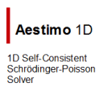

After December 2023, we use our corporate website for our website needs. There are some small websites under [https://lrgresearch.org](https://lrgresearch.org). You can find links for these sites below.

## LRG Websites

| Website | Description                           |
| -------------------------------------- | ------------------------------------ |
|  | Institutional website for LRG. [Visit site](https://avesis.gazi.edu.tr/arastirma-grubu/lrg)|
|  | Sefer Bora Lisesivdin's personal webpage. [Visit site](https://lrgresearch.org/bora)|

## Project websites

| Project | Description                           |
| -------------------------------------- | ------------------------------------ |
| | Ga2O3/Cu2O p-n junction production and related computational studies with p-type Cu2O semiconductor thin films grown by Mist-CVD. [Visit site](https://www.lrgresearch.org/cuoxmist) |
| | Investigation of Growth Behaviors and 2DEG Properties of MgZnO/ZnO Heterostructures grown by USPECVD. [Visit site](https://www.lrgresearch.org/deha) |
|  | High-Performance Modelling and Experimental Investigation of Transport and Device Properties of GaN-based High Electron Mobility Transistors with Ultrathin Barriers. [Visit site](https://www.lrgresearch.org/ultrathin/) |
|  | Modification of properties of two-dimensional electronic gas using in-situ surface passivation of AlGaN/GaN heterostructures by molecular beam epitaxy. [Visit site](https://www.lrgresearch.org/sinongan/) |
|  | Investigation of the effects of transition metal palladium on electronic, structural, and optical properties of graphene nanoribbons. [Visit site](https://www.lrgresearch.org/graphenepd/) |
|  | Numerical optimization of MgxZn1-xO/ZnO and BexZn1-xO/ZnO based heterostructure transistors. [Visit site](https://www.lrgresearch.org/oxidehemt/) |

## Open-source software 

| Software| Description                           |
| -------------------------------------- | ------------------------------------ |
|  | An UI/GUI for DFT and MD calculations with GPAW/ASAP/ASE.[Visit site](https://www.lrgresearch.org/gpaw-tools) |
|  | 1D Self-consistent Schrödinger Poisson Solver. [Visit site](https://www.aestimosolver.org) |
|  | Folder queue manager for remote working. [Visit site](https://github.com/lrgresearch/Folder-Queue-Manager) |
